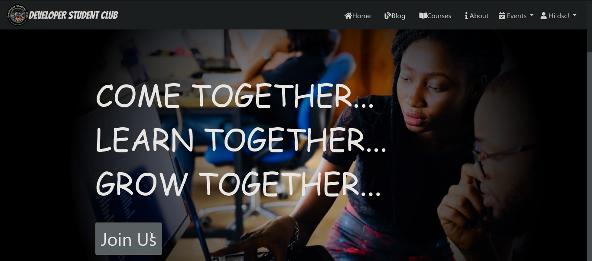

# DSCWEB

  **DSC(Developer Student Club)** is a official Technical club running in [Rajkiya Engineering College, Bijnor](http://recb.ac.in/) since 2019. DSCWEB is a web project to build website for **DSC club.**

  

## Links:

- [Facebook](https://www.facebook.com/dscrecbijnor/)
- [Twitter](https://twitter.com/DscRec)
- [Instagram](https://www.instagram.com/dscrecbijnor/?igshid=b8dp92k5qnhu)

---

## Project Status

- Under Developement

## Project Details

This project is built on the *Django Framework(3.0)*. This project is building by [Kumar Shanu](https://github.com/its-Kumar)(at Back-end Developement) and [Rajat Yadav](https://github.com/rajatyadav8540/)(at Front-end Development).

---

## Developement

### Running the Server

Make sure you have installed **python (3.7)** and **django**. If don't have download python from [here](https://python.org/) and run the command **` pip install django `** to install django.\
If this doesn't work you can install all reuqirements once by using the **` pip install -r requirements.txt `** command. All requirements are mentioned in *`requirements.txt`* file.\
After that run the server as follow-

```bash
cd path/to/dir
python manage.py runserver 8000
```

here 8000 is port number. you can use any port number you want.

### Admin

    django admin : dsc
    password :

---
## Contributers

<table>
  <tr>
    <td>  </td>
    <td>  </td>
    <td>  </td>
  </tr>
    <tr>
    <td> <a href="https://github.com/its-Kumar"> its-Kumar </a> </td>
    <td> <a href= "https://github.com/rajatyadav8540/"> rajatyadav8540 </a></td>
    <td> <a href= "https://github.com/durgesh2001"> durgesh2001 </a></td>
  </tr>
</table>
